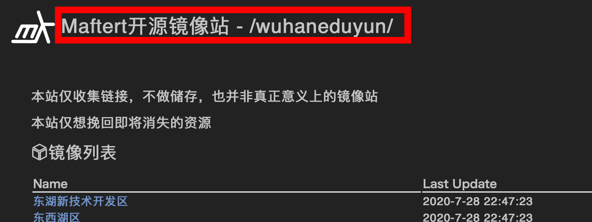
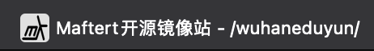
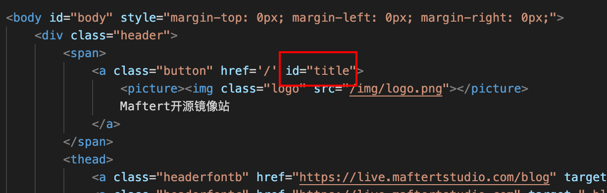
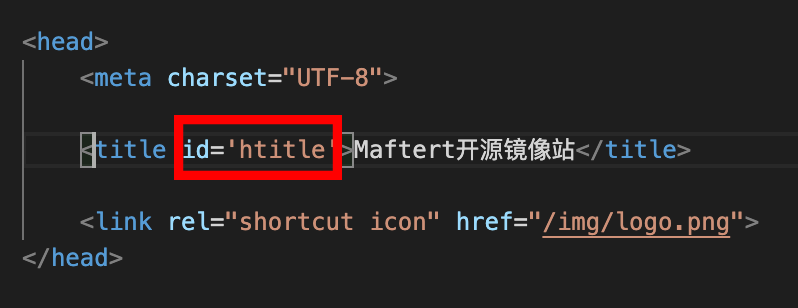

# wdgX

[](https://www.npmjs.org/package/wdgx)
[](https://npmcharts.com/compare/wdgx?minimal=true)
[](https://packagephobia.now.sh/result?p=wdgx)

静态网站目录生成

相当于镜像站

- [wdgX](#wdgx)
  - [安装](#安装)
  - [配置](#配置)
    - [cttp和hcttp](#cttp和hcttp)
      - [cttp](#cttp)
      - [hcttp](#hcttp)
      - [怎么配置](#怎么配置)
    - [disable_index 和 disable_catalog](#disable_index-和-disable_catalog)
    - [e.html](#ehtml)
  - [generation](#generation)
  - [Start Server](#start-server)

## 安装

```shell
npm install wdgx -g
```

## 配置

找到要使用wdgx的文件夹, 使用"wdgx -i"来初始化

然后你可以发现当前目录下生成了"wdgx-config.json"

如果要重新初始化，请输入"wdgx -i -f"

```json
{
    "path": "./", // 要使用的文件夹
    "printprogressbar": true, // 是否打印进度（弃用）
    "cttp": true,
    "hcttp": true,
    "e_html": "./e.html",
    "disable_index": [
        "index.html",
        ".git",
        "CNAME",
        ".DS_Store",
        "README.md",
        "json",
        "e.html",
        "js",
        "css",
        "node_modules",
        "package.json",
        "package-lock.json",
        "LICENSE",
        ".gitignore",
        "wdgX-config.json"
    ],
    "disable_catalog": [
        "img",
        "documents"
    ],
    "change_title": [ // 将文件名替换为
        {
            "img": "photos"
        }
    ]
}
```

### cttp和hcttp

#### cttp




#### hcttp




#### 怎么配置



use id="title"



use id="htitle"

### disable_index 和 disable_catalog

disable_index 相当于删除文件（但是仍存在）

disable_catalog 相当于隐藏文件

### e.html

基本的html

必须要有以下内容：

```html
<table>
    <thead>
        <th>Name</th>
        <th>Last Update</th>
    </thead>
    <tbody id="filelist">

    </tbody>
</table>
```

这是存放目录的html元素, id必须为filelist

[示例:](https://github.com/Xiaozeze127/wdgX/blob/master/example.html)

[示例网站:](https://mirrors.maftertstudio.com)

## generation

找到"wdgx-config.json"

```shell
wdgx -g
```

等待几秒，他就好了

你可以看到所有目录下都会生成index.html文件

## Start Server

我们提供了启动服务器的服务,当然你也可以将此文件夹移到nginx等等

```shell
wdgx -s

              _      __  __
 __      ____| | __ _\ \/ /
 \ \ /\ / / _` |/ _` |\  / 
  \ V  V / (_| | (_| |/  \ 
   \_/\_/ \__,_|\__, /_/\_\
                |___/      
Starting up http-server, serving ./
Available on:
  http://127.0.0.1:4000
  http://172.20.10.5:4000
Hit CTRL-C to stop the server
```

获取更多"wdgx -s"信息, 请输入"wdgx -s -h"
