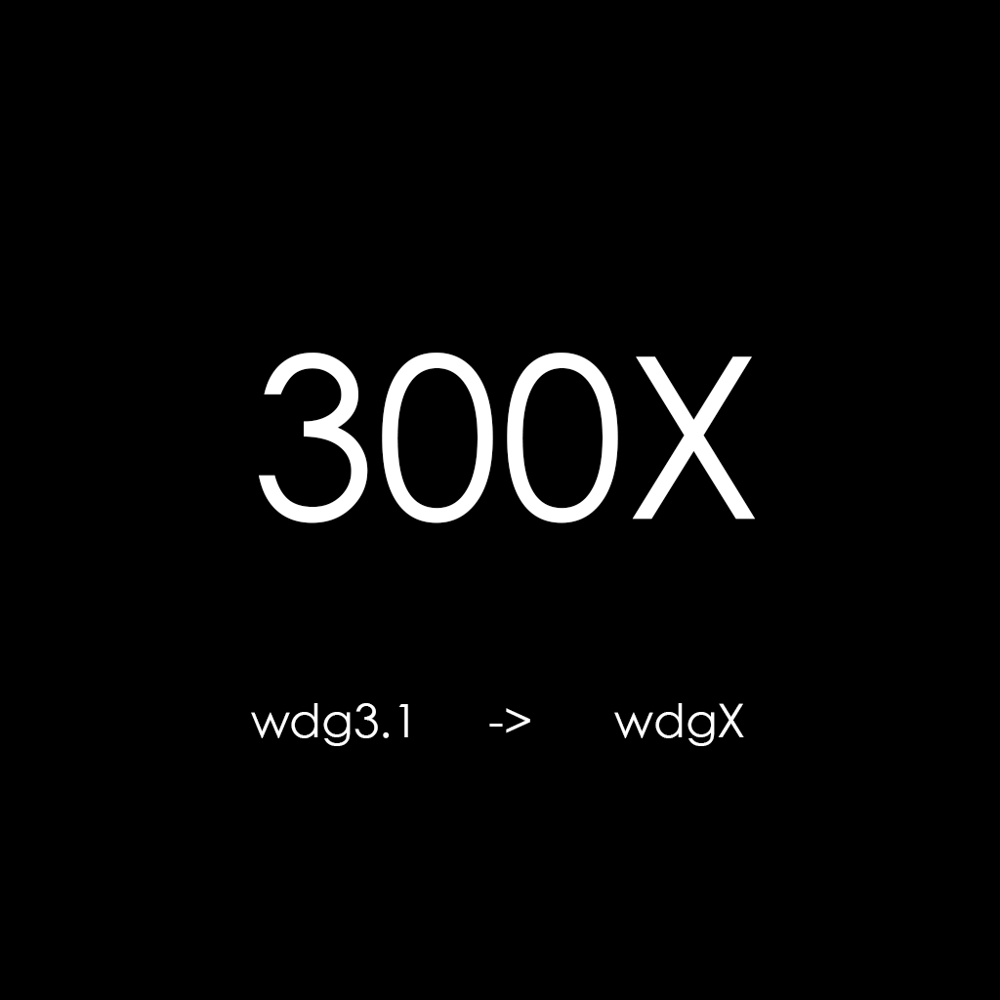
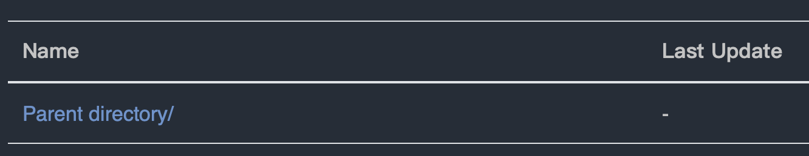
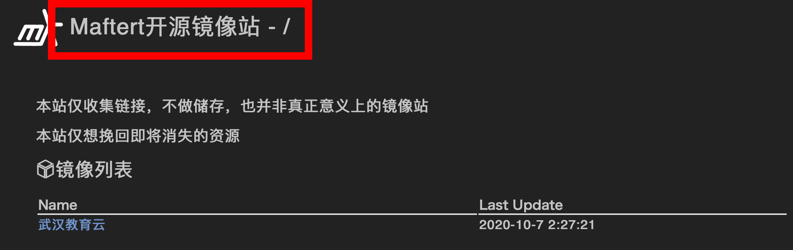
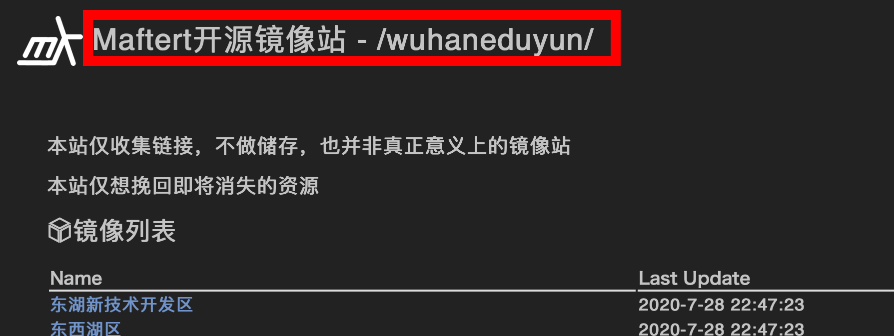
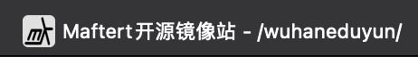
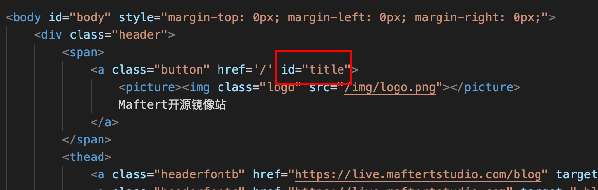
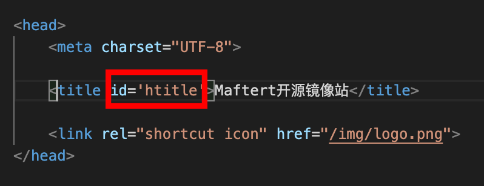

# wdgX

[](https://www.npmjs.org/package/wdgx)
[](https://npmcharts.com/compare/wdgx?minimal=true)
[](https://packagephobia.now.sh/result?p=wdgx)
[](https://github.com/xiaozeze127/wdgX)

Static website directory generation

It's like a mirror station

- [wdgX](#wdgx)
  - [Version](#version)
    - [3.0](#30)
    - [1.6](#16)
    - [1.5](#15)
    - [1.4](#14)
    - [wdg3.1 to wdgX 1.0](#wdg31-to-wdgx-10)
  - [Install](#install)
  - [Config](#config)
    - [liststyle](#liststyle)
    - [pd](#pd)
    - [Differences between cttp and hcttp](#differences-between-cttp-and-hcttp)
      - [cttp](#cttp)
      - [hcttp](#hcttp)
      - [How to config cttp and hcttp](#how-to-config-cttp-and-hcttp)
    - [disable_index and disable_catalog](#disable_index-and-disable_catalog)
    - [e.html](#ehtml)
  - [generation](#generation)
  - [Start Server](#start-server)

## Version

### 3.0

you can use 'wdgx -c' to clear all web pages (i.e index.html )

### 1.6

Support custom list style

### 1.5

Support hexo  
Change cttp, hcttp and change_title collocation method  

### 1.4

Supports changing suffixes (for example, can be index.html It can also be index.md )  
Support the ID of custom website and page title (cttp and hcttp)  
Support display and return to upper level folder 

### wdg3.1 to wdgX 1.0



300 times faster!

wdg3.1 uses python, wdgX uses JavaScript  
And wdgX supports the command line

## Install

```shell
npm install wdgx -g
```

## Config

Find the folder where you want to use the wdgX, and need use "wdgx -i" to init

Then you can see a new file called "wdgx-config.json" in the current directory

If you want to reinitialize, please enter "wdgx -i -f"

```json
{
    "path": "./", // Folder to use
    "suffix": "html", // file extension
    "cttp": "title", // Whether to change the website title, see below
    "hcttp": "htitle", // Whether to change the page title,see below
    "pd": true, // Display upper level folder
    "e_html": "./e.html", // Basic HTML
    "liststyle":{ // style for list, see below
        "Name": "tname", // name css style
        "date": "tt" // time css style
    },
    "disable_index": [ // Do not generate these files to web pages
        "index.html",
        ".git",
        "CNAME",
        ".DS_Store",
        "README.md",
        "json",
        "e.html",
        "js",
        "css",
        "node_modules",
        "package.json",
        "package-lock.json",
        "LICENSE",
        ".gitignore",
        "wdgX-config.json"
    ],
    "disable_catalog": [ // Hide these files to the web page
        "img",
        "documents"
    ],
    "change_title":{  // Switch the names of these files
        "img": "photos"
    },
    "markdown": { // Blog function(Hexo) https://hexo.io/docs/front-matter
        "YN": false, // Whether to enable markdown parameter
        "layout": false, // false or "string"
        "title": {
            "title": false, // false or "string"
            "cttp": false // false or "string"     Whether to change the website title
        },
        "img": {
            "img": false, // false or "string"
            "file": "/img/background.png" // "string"
        },
        "tags": false, // false or "string"
        "date": false, // false or "string"
        "updated": false, // false or true or "string" (If true, the current time is used)
        "comments": false, // false or "string"
        "categories": false, // false or "string"
        "permalink": false // false or "string"
    }
}
```

### liststyle

```html
<td><a class="tname" href="">name</a></td><td><a class="tt">time</a></td>
```

This is the HTML added to the list

Now the file name uses the css "tname'  
the file last update time uses the css "tt'

You can customize it (We require it to be filled in),like:

```json
{
    "liststyle":{
        "Name": "filename",
        "date": "filetime"
    },
}
```

HTML will become 

```html
<td><a class="filename" href="">name</a></td><td><a class="filetime">time</a></td>
```

### pd

means Parent directory

effect:



### Differences between cttp and hcttp

#### cttp





#### hcttp




#### How to config cttp and hcttp



```json
{
    "cttp": "title",
}
// If you don't want to use it
{
    "cttp": false
}
```



```json
{
    "hcttp": "htitle"
}
// If you don't want to use it
{
    "hcttp": false
}
```

### disable_index and disable_catalog

disable_index will not generate links in the directory,And if it is a directory, no web page will be generated in this directory

disable_catalog is equivalent to a hidden folder

### e.html

Basic HTML content

You need the following:

```html
<table>
    <thead>
        <th>Name</th>
        <th>Last Update</th>
    </thead>
    <tbody id="filelist">

    </tbody>
</table>
```

This is the file directory section, id must be filelist

[example:](https://github.com/Xiaozeze127/wdgX/blob/master/example.html)

[example website:](https://mirrors.maftertstudio.com)

The directory name must be in the "tname" style, time has to be in "tt" style

Because html is:

```html
<td><a class="tname" href="">Name</a></td><td><a class="tt">Time</a></td>
```

## generation

Find the generate "wdgx-config.json" folder

```shell
wdgx -g
```

Wait a few seconds, and he's done

As you can see, they are generated in all directories index.html file

## Start Server

We provide a service to start the server, and of course you can also move this folder to nginx

```shell
wdgx -s

              _      __  __
 __      ____| | __ _\ \/ /
 \ \ /\ / / _` |/ _` |\  / 
  \ V  V / (_| | (_| |/  \ 
   \_/\_/ \__,_|\__, /_/\_\
                |___/      
Starting up http-server, serving ./
Available on:
  http://127.0.0.1:4000
  http://172.20.10.5:4000
Hit CTRL-C to stop the server
```

For more help on "wdgx -s", please enter "wdgx -s -h"
